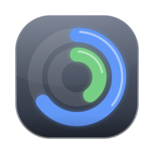

<p align="center"></p>

# Claude Usage

A tiny macOS menu bar app that shows your Claude usage at a glance — two rings, always visible, no need to open a browser tab.


- **Outer ring** — your 5-hour session limit
- **Inner ring** — your weekly limit
- Rings turn orange, then red, as you approach a limit
- Click the icon for exact percentages and reset times — including any per-model weekly caps (e.g. Sonnet, Fable) your plan tracks separately
- Refreshes on click, when your Mac wakes up, and every 15 minutes in the background

## Download

**[Download the latest release](https://github.com/gokulmc/claude-usage-menubar/releases/latest)** — open the `.dmg` and drag ClaudeUsage into Applications. No Xcode or Swift needed. The DMG is Developer ID signed and notarized, so Gatekeeper won't show a warning and "Always Allow" on the one-time Keychain permission prompt genuinely sticks.

Prefer to build it yourself instead? See [Build from source](#build-from-source) below.

## Requirements

- macOS 13 (Ventura) or later
- [Claude Code](https://claude.com/claude-code) installed and logged in — this app reads the same OAuth credentials Claude Code stores in your macOS Keychain, so there's nothing extra to configure
- Building from source only: Xcode Command Line Tools (for the Swift compiler): `xcode-select --install`

## Build from source

```bash
git clone https://github.com/gokulmc/claude-usage-menubar.git
cd claude-usage-menubar
./setup-signing.sh   # recommended, one-time — see below
./build.sh
```

`build.sh` builds a release binary, packages it as `ClaudeUsage.app`, code-signs it, copies it to `/Applications`, and launches it. The icon should appear in your menu bar within a couple of seconds.

The first launch will ask for permission to read the `Claude Code-credentials` Keychain item — click **Always Allow**.

To update after pulling new changes, just run `./build.sh` again.

### Why `setup-signing.sh`?

`build.sh` needs a stable code-signing identity to reuse across rebuilds; without one it falls back to ad-hoc signing, and every rebuild looks like a brand-new app to the Keychain, so macOS asks for your login password again after each one. `setup-signing.sh` creates and trusts a local identity (`ClaudeUsageLocalSign`) so rebuilds keep the same identity and don't each cost you a prompt. It's scoped entirely to your own login keychain — no sudo, no system-wide changes. (It can't make the prompt disappear *entirely* — see [Troubleshooting](#troubleshooting) for the fine print — but combined with the app's own token cache, prompts should be rare.)

### Launch at login

Click the menu bar icon and check **Launch at Login** to have it start automatically every time you sign in.

### Uninstall

```bash
osascript -e 'tell application "ClaudeUsage" to quit'
rm -rf /Applications/ClaudeUsage.app
```

(If you enabled Launch at Login, also uncheck it from the app's menu first, or remove it from System Settings → General → Login Items.)

## How it works

Claude Code stores your OAuth token in the macOS Keychain under the service name `Claude Code-credentials`. This app reads that token and calls Anthropic's usage endpoint (`GET /api/oauth/usage`) to get your current 5-hour and weekly utilization — the same numbers Claude Code shows with `/usage`. Nothing is sent anywhere except Anthropic's API; there's no third-party server involved.

This uses an internal, undocumented API endpoint, so it could change or break without notice.

**A note on how the token is cached, and the tradeoff involved.** Reading another app's Keychain item (`Claude Code-credentials` belongs to Claude Code, not this app) is a cross-app access that macOS gates behind a confirmation prompt. To avoid re-prompting on every launch and every poll, this app copies the token into a **second Keychain item that it creates and owns** (`com.gokul.claude-usage.token-cache`). Reading back an item you created yourself is never prompted by macOS, regardless of code signing — so normal operation never touches Claude Code's item at all, only this app's own copy.

- **If you use the downloadable DMG** (Developer ID signed + notarized): "Always Allow" on the one-time confirmation prompt genuinely sticks, and the token cache makes that prompt rare anyway. The second Keychain copy is straightforward convenience.
- **If you build from source** with a self-signed identity: "Always Allow" doesn't stay silenced permanently on its own (see [Troubleshooting](#troubleshooting) for why). In this path the token cache is more than convenience — it's what makes the app usable without repeated password prompts. The second copy is still protected by FileVault + per-user Keychain permissions, but note that there are now two Keychain items holding the same live OAuth token instead of one.

Neither path sends your credentials anywhere except Anthropic's own API; there's no third-party server involved.

## Troubleshooting

**Menu bar item shows a gray "!" badge.** The last refresh failed — usually because Claude Code's credentials need refreshing. Open Claude Code and run any command, then click **Refresh Now** in the app's menu.

**macOS asks for my login password when the app reads the Keychain.**

- *If you use the downloadable DMG:* the app is Developer ID signed and notarized. The first launch will ask once — click **Always Allow** and you won't see it again unless Claude Code rotates its token (infrequent). The token cache handles normal operation silently.
- *If you build from source:* some of this is expected and some is fixable.
  - *Expected:* the first-ever read of Claude Code's credentials item, and again whenever Claude Code rotates its token and the app has to re-read it. Thanks to the token cache, normal launches and polls never touch that item, so this should be occasional.
  - *Every time you rebuild:* the app is ad-hoc signed (no `ClaudeUsageLocalSign` identity was found), so each rebuild produces a new binary hash that macOS treats as a "different app." Run `./setup-signing.sh` once, then `./build.sh`.
  - *The hard limit:* "Always Allow" doesn't stick permanently for self-signed code. macOS only grants durable silent Keychain access to code with a certificate that chains to Apple's root (a paid Developer ID certificate); for self-signed or ad-hoc builds, `securityd` re-validates on its own schedule. The token cache makes those cross-app reads rare, which is the best that can be done without an Apple Developer account.

**Can it use Touch ID instead of a password?** No — this specific Keychain authorization dialog is a legacy dialog type that macOS never offers Touch ID for, even on Macs with Touch ID enrolled. Nothing the app can do about it; the mitigation is making the prompt rare (above), not making it more convenient.

## Changelog

See [CHANGELOG.md](CHANGELOG.md).

## License

[MIT](LICENSE)
