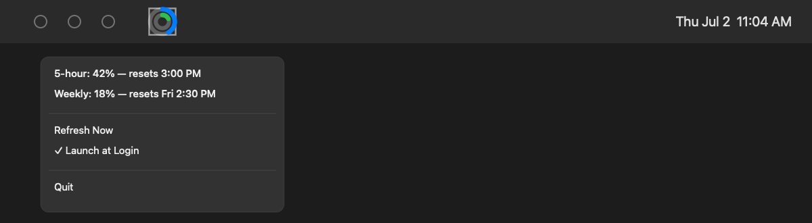

# Claude Usage

A tiny macOS menu bar app that shows your Claude usage at a glance — two rings, always visible, no need to open a browser tab.



- **Outer ring** — your 5-hour session limit
- **Inner ring** — your weekly limit
- Rings turn orange, then red, as you approach a limit
- Click the icon for exact percentages and reset times
- Refreshes on click, when your Mac wakes up, and every 5 minutes in the background

## Requirements

- macOS 13 (Ventura) or later
- [Claude Code](https://claude.com/claude-code) installed and logged in — this app reads the same OAuth credentials Claude Code stores in your macOS Keychain, so there's nothing extra to configure
- Xcode Command Line Tools (for the Swift compiler): `xcode-select --install`

## Install

```bash
git clone https://github.com/gokulmc/claude-usage-menubar.git
cd claude-usage-menubar
./build.sh
```

`build.sh` builds a release binary, packages it as `ClaudeUsage.app`, code-signs it, copies it to `/Applications`, and launches it. The icon should appear in your menu bar within a couple of seconds.

The first launch will ask for permission to read the `Claude Code-credentials` Keychain item — click **Always Allow**. You'll only see this once.

To update after pulling new changes, just run `./build.sh` again.

### Launch at login

Click the menu bar icon and check **Launch at Login** to have it start automatically every time you sign in.

### Uninstall

```bash
osascript -e 'tell application "ClaudeUsage" to quit'
rm -rf /Applications/ClaudeUsage.app
```

(If you enabled Launch at Login, also uncheck it from the app's menu first, or remove it from System Settings → General → Login Items.)

## How it works

Claude Code stores your OAuth token in the macOS Keychain under the service name `Claude Code-credentials`. This app reads that token locally and calls Anthropic's usage endpoint (`GET /api/oauth/usage`) to get your current 5-hour and weekly utilization — the same numbers Claude Code shows with `/usage`. Nothing is sent anywhere except Anthropic's API; there's no third-party server involved.

This uses an internal, undocumented API endpoint, so it could change or break without notice.

## Troubleshooting

**Menu bar item shows a gray "!" badge.** The last refresh failed — usually because Claude Code's credentials need refreshing. Open Claude Code and run any command, then click **Refresh Now** in the app's menu.

**macOS keeps asking for my login password after every rebuild.** This shouldn't happen — `build.sh` signs the app with a stable local identity (`ClaudeUsageLocalSign`) so the same "Always Allow" choice persists across rebuilds. If that identity doesn't exist yet on your machine, the script falls back to ad-hoc signing, which *will* re-prompt on every rebuild. To fix it, create a local self-signed code-signing certificate named `ClaudeUsageLocalSign` in your login keychain (Keychain Access → Certificate Assistant → Create a Certificate → type: Code Signing) and re-run `./build.sh`.

## License

[MIT](LICENSE)
